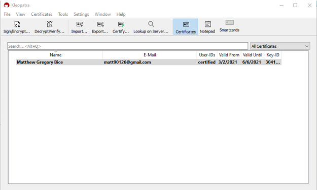
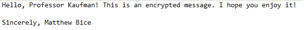

# Demonstrating RSA Encryption with GnuPG and Kleopatra

## Introduction

This first part of the paper is dedicated to explaining and analyzing the steps that were taken for this lab. The objective here is to introduce the basic methods used for encrypting messages and files. In this case, we will focus only on RSA encryption and how it is able to encrypt and decrypt simple text files. I will be using an open-source software known as Gpg4win and its certificate managing tool Kleopatra to carry out this process. I will begin by first explaining the installation and setup of Gpg4win and then go into detail about creating the OpenPGP key pair I will be using. From there, I will describe the processes of encryption and decryption and finally conclude with some final reflections.

## Installing Gpg4win and Preparing for Encryption

Before I can start any work with encryption, I must first set up my workspace. The only things I need are my email, a text editor (in this case, Notepad), and a software known as Gpg4win. To be specific, I will be using Gpg4win version 3.1.15. According to the “about” page on its website, Gpg4win is an open-source software that enables users to securely transport emails and files with the help of encryption and digital signatures (Gpg4win). As the name suggests, this software’s focus is to implement GNU Privacy Guard and its features into Windows. This will be the primary tool for the lab as it will be handling all of the encoding and decoding. Although Gpg4win is referred to as a singular unit, it is actually made up of several smaller components: GnuPG the encryption tool, Kleopatra the certificate manager, GpgOL and GpgEX for additional email and file encryption, and GPA, another certificate manager. For this lab, I will only be using Kleopatra and GnuPG for key creation, certification management, and message encryption (and for the sake of precision, I will be referring to these programs separately).

Once the software has been installed, I am now ready to begin the first steps of encryption. The directions for this lab specify that I will be working with RSA encryption. To provide a brief overview, RSA encryption is a type of asymmetric encryption in which a message is encrypted with a public key anyone can use and decrypted with a private key that the intended recipient possesses (Lake). The process of RSA is as follows: First, a public and private key pair is generated. The most common method of generating this key pair is through equations that deal with extremely large prime numbers. The idea here is that the end result is easy to see but to figure out the individual parts would be nearly impossible. After the keys have been created, the next step is to use the public key to encrypt the message. Once the message has been encrypted, it is now scrambled based on the key’s algorithms and is indecipherable. From there, the message can now travel through the network to its intended recipient who then decrypts it with his or her own private key. The process concludes with the message being restored to its original form. The perk of RSA encryption is that the message’s contents are totally hidden when it is encrypted. Even if an intruder were to intercept it, the message would be unusable to him or her without the proper private key. This lab will demonstrate this process thusly except that it will be in a more simplified form.

## Creating the Public and Private Key Pair and Exchanging Public Keys

Upon running the Gpg4win executable file, the GUI for Kleopatra is opened. As mentioned, this is the certificate manager, and I will be using it for creating and importing key pairs for encryption and decryption. The first step, however, is to create the keys. Rather than having to deal with complex algorithms, Kleopatra has a more simplified process in that it uses a Creation Wizard to automatically generate a key pair given only a few key pieces of information. The user needs only to provide his or her name, an email address, and, if they wish, specifications on the form of encryption and for what purpose(s) it will be used. The figure below shows the creation process for my own key pair:

- <i>Figure 1</i>: Here we see the GUI for Kleopatra along with the basic and advanced dialogue windows for creating a new key pair. My name and email are filled out in the first window and the advanced window is filled out according to the lab instructions. This key pair will only be used for encryption (it will not sign or authenticate) and is valid until June 6, 2021.

  

Notice that for this lab, I will be using 2048-bit RSA encryption. This bit value refers to the lengths of the key pair which, in turn, refers to the size of the SSL, or Secure Socket Layer, certificate (Gloag). In other words, this number indicates the strength of the key: The longer the key, the stronger the encryption will be and the more difficult the message or file will be to crack (Oracle). In this regard, a 2048-bit key length is a formidable security measure because this signifies that the products of the prime numbers with which the algorithm will be working are up to 617 digits long (Lake). It is no wonder, then, that 2048-bit RSA encryption is considered by most to be the industry standard in terms of encryption strength and is the most frequently recommended (Giry). However, as an aside, it is superficial to apply the blanket statement “the bigger, the better” when it comes to key length because once a key is fully able to withstand a brute force attack, any additional bits only needlessly complicate matters and would be considered a waste of resources. Nevertheless, with my parameters set, my key pair is successfully created. The figures below show the creation of the key pair and implementation of the new certificate. 

- <i>Figure 2</i>: A pop-up window signifying that the key pair was successfully created. The fingerprint provided is so that users can verify that the key pair belongs to me and validate my certificate.

  

- <i>Figure 3</i>: The Kleopatra GUI with the “certificates” section active. The key pair I have created is visible in the box and is certified. This means my public and private keys are active and I can now encrypt and decrypt emails and files.

  

Now here is where the lab really gets interesting. To demonstrate its concepts, I will be sending an encrypted message to my professor. In order to do so, however, we must first exchange public keys. I sent my newly created public key in an email to him and downloaded his public key to my computer and imported it into Kleopatra. When this was done, I also had to certify my professor’s key to prove that he is the owner and verify the certificate’s fingerprint (Mutz). In turn, I can only assume that he has done the same for my public key. With the keys successfully exchanged, I am now ready to create a message for encryption.

## Creating, Sending, and Receiving Encrypted Messages

Now for the actual creation of the message I wish to encrypt. I must admit that there is nothing too fancy going on in this step. I merely opened my basic version of Notepad and wrote a little message without much thought as shown below:

- <i>Figure 4</i>: My original text message as seen in Notepad. Aside from its contents, the only thing to bear in mind here is that I have stuck with using alphabetical characters with only a few special characters for punctuation.

  

With my message created, I save it in a simple text file and return to Kleopatra to begin the encrypting process. I select the “Sign/Encrypt…” button on the tool panel and open a new dialogue window, shown below:

- <i>Figure 5</i>: The dialogue window of Kleopatra for encrypting files using GnuPG. I have disabled signing my message and that it will be encrypted only with my professor’s public key. Additionally, notice that his key pair appears in the “certificates” section in the background and is certified by me. Not pictured is the “create signed or encrypted files as text files” option being enabled.

  

Now this is where GnuPG comes into play. There is a specific way I am meant to encrypt my message. That is, I am to remove any ownership of the message. This means once the message has been encrypted, it will become unintelligible even to me, the original writer. Moreover, the directions require the output to be text only or, as previous iterations of the software have referred to it, with ASCII armor (Mutz). This is where I had to deviate from the directions a bit because, as I had discovered, this feature had been removed in my version. It had instead been translated into the configuration menu where it was now an option to “create signed or encrypted files as text files.” With this option enabled, the encryption process is performed, and I am left with the encrypted file.

This new file has two notable properties: First, my text file has been changed from .txt to .asc. A .asc file, or Action Script Communication file, is a file that, when opened, will used by a desired program (ReviverSoft). In the case of this lab, the desired program is GnuPG. Second, and perhaps more specifically, this particular .asc file is an OpenPGP text file. This means that my file has been encrypted with software that follows the PGP (Pretty Good Privacy) standards of encryption (FileInfo). Therefore, my text file has been successfully encoded with RSA 2048-bit encryption. To illustrate this, the figure below shows my message after the encryption process.

- <i>Figure 6</i>: My message after being encrypted. The “begin” and “end” flags have been added by the program. Also note that there is significantly more content in the encrypted message than the original. This message has been scrambled with the RSA algorithm with a 2048-bit key length. It is virtually immune to any brute force attacks.

  

With this new file obtained, I am now finished with creating and encrypting my message. The next step is to email the encrypted file as an attachment to my professor who, given my public key, will be able to receive and decrypt it on his end. I then set my email up according to the standards given in the directions and sent it to him.

After some time has passed, my professor responded with his own email. He has indicated that my message had been successfully received and decrypted and provided me with an encrypted message of his own using my public key. His message, however, follows a different file format. Instead of having the .asc file extension, his has a .gpg extension which signifies that this is a file that was created using GnuPG (FileInfo). Moreover, this file is classified as an OpenPGP binary file rather than a text file. Even so, the file appears to behave similarly to the .asc file I created in that it will still open Kleopatra and GnuPG when activated. Therefore, within the scope of this lab, I regard any differences in terms of the nature of these files to be negligible. That being said, I open the file as per usual and run GnuPG to decrypt it. This lab report requires an appendix so you will find the decrypted message there. With my professor’s message restored to its original form, the lab is now concluded.

- <i>Figure 7</i>: Provided below is the message my professor sent to me after decryption:

  

## Conclusion

Finally, as an afterthought, this section of the lab actually took two attempts. Originally, I had encrypted my message using both the professor’s public key and my own public key. However, this does not seem to work because my professor has stated that he will be unable to decrypt the message if I do so. I found this rather interesting because the ability to encrypt messages for multiple public keys appears to be one of the primary selling points for GnuPG. Things like this led me to believe that GnuPG and Kleopatra are remarkably complex pieces of software and make me wonder about their potential applications outside of this lab.

# Discussing Public Key Infrastructure and Its Implications

Public Key Infrastructure (PKI) is a generic term that is used for anything that involves the implementation and management of public key encryptions. It is one of the most widely used security infrastructures in cyberspace and secures a myriad of information and web applications (CSO). Included in this term is the RSA encryption that was demonstrated in the previous part. This is a prime example of public key infrastructure in its simplest form: People encrypt information with an easily accessible public key and decrypt it with a well-hidden private key. Simple in essence, although this was done in a very idealized environment. That is, the communications were only between two people, the files were not even remotely complex, and perhaps most of all, both people were familiar with the concepts of cyber security. If there was one thing that I have noticed when it comes to discussing PKI, it is that only someone who is at least a little bit familiar with cyber security is able to understand what I am saying. To an outsider, this process is enormously complex, and they may not only misunderstand the principles of PKI, but also the very encryption software they use for their businesses on a daily basis. It is this topic and more that I would like to address in this part of the lab report. I will be calling attention to the drawbacks and benefits of PKI in addition to discussing the potential implications of each.

I would first like to begin by reemphasizing what was addressed in the first paragraph. I do firmly believe that there is a lack of succinct and sufficient information for people outside of the field of cyber security. I have tried many times to speak with my family and friends about these concepts only to find that they do not entirely grasp them. This, of course, does not mean that they are unknowledgeable since they possess a plethora of information regarding subjects such as business, sciences, the arts, and so on. The truth of the matter is that this information is simply not common knowledge. Truthfully, it took some time for even me, a cyber security student, to grasp the concepts of PKI. If I, who devotes so much time to understanding networks and information systems, can have a difficult time understanding PKI, then I can only imagine how much difficulty an outsider would have. Furthermore, the information that is available does still take some brain power to comprehend. The understanding I have obtained has mostly come from institutional instructors and privately-owned (and expensive) textbooks. I have found very few resources that are able to put PKI into a form that is easily digestible which I think is a necessity if it is going to be so widely implemented. This is a significant drawback to PKI. There are people all over the internet running amuck and throwing their information this way and that with little regard to what is happening on the back end. They have a firm belief that “it just works” and that their information is somehow kept safe. If PKI is to be successfully implemented, trainers, instructors, developers, and any pedagogues of cyber security must first focus on making information about it public and, most of all, easy to understand.

Another drawback of PKI has to do with performance. I had touched on this previously when discussing key length. There is an upper limit for PKI in terms of performance. It is my understanding that since it does follow a mathematical algorithm, there is a finite possibility of combinations, regardless of how many. Furthermore, a key can only be so long and strong until it begins to be detrimental to the system. The way I see it, there is a very rigid expectation for PKI. 2048-bit keys are widely considered to be the industry standard. Anything less is potentially a compromise to security, and anything more is a burden on processing power and network activity. This is a definite weakness since this would be a reason why secret-key could be considered superior. Security practitioners believe that so long as a key is able to withstand a brute force attack, it is as good as it can possibly be. Yet I find this to be wishful thinking. Seeing that encryption technology is now able to overcome a brute force attack, which is the most direct means of cracking an encrypted message, I have to wonder if the hackers and “bad guys” of the digital world are making advancements in technology that will be able to conquer PKI. If that is so, then I do not believe that people should be so rigid with the development and implementation of PKI. Whether attacking or defending, there is always room for improvement, and this must be kept in mind if people want to adopt PKI.

Indeed, PKI leaves little room for cyber-attacks, but people must also keep in mind that a security system is only as effective as the person who is using it. Public keys are all well and good since they are made easily available and serve only to encrypt information. The concern, I think, comes from the private keys. This is the half of asymmetric encryption that a user must protect and never give away. This does seem easy enough to understand, but security practitioners must always remember that although their machines and systems may be seemingly infallible, the people who use them are not. One of the most pressing forms of cyber-attacks is social engineering. I think that a person could still be just as easily manipulated into giving their private key information away as they could be instructed to keep it safe. Social engineers have progressively been becoming craftier with each additional security measure and will always find ways into people’s minds and systems if the proper instruction and information is not given. Furthermore, PKI has the potential to lull people into a false sense of security. In short, Chron describes public key encryption as only being able to protect what it was designed to protect. Although high-profile communications over a network may be safe, this may cause people to be negligent to their more immediate security threats. It is true that decrypted information is only accessible to your own computer. However, if someone were to gain access to your computer, be it from accessing your computer remotely or through the server in which it is situated, this information can still be stolen. Since people can never be perfect, I feel that this will be a perpetual drawback and that PKI engineers, developers, and instructors should work to minimize the margin for human error as much as possible.

Despite these drawbacks, there is still plenty to be said in terms of benefits. First off, Digital Guardian states that public key cryptography is the most secure protocol because users never need to transmit or reveal their private keys to anyone. To refute my last drawback, public key cryptography can still be the most secure means as long as the private key is kept hidden. Moreover, public keys also use unique signatures for each user that cannot be repudiated. This was seen during the lab in which the user had the option to provide a digital signature to their encrypted message. This can be especially useful for environments in which there are large amounts of communications. Despite all the users, a sender needs only to focus on encrypting the information for the recipient’s public key. From there, so long as the private keys are kept safe, the information is able to travel across the network to the recipient. In turn, the sender is free of any concerns regarding message interception. The only need for concern here is that public keys and certificates must be effectively managed for every user. Though this may seem cumbersome, I could very easily imagine programs like Kleopatra making it easier. In this way, I do see PKI as definitely being a benefit in the world of security.

Public key infrastructure is also one of the most popular choices for businesses because it provides an easier alternative to nettlesome management over employee password strength and security. Michael Sutiono, a leader for the small financial business Cermati, describes his experience of implementing PKI as a means of handling credential and access management. He viewed it as a more favorable approach to the improvised and less sophisticated methods he and his team were using in the past. He describes how the implementation was providing each of his team members with a certificate bundle that was able to be authenticated and allow access to private internal resources while also giving him and anyone in charge the ability to revoke the certificates at any time. This would simultaneously strengthen and simplify security measures for the business since Sutiono has more direct control over certificate management and authentication while his team members can send secure communications across the network with little concern regarding interception. As seen here, PKI has the potential to be a huge asset for small business if its information were to be made more readily available.

As the final benefit for PKI, I do view it as being the most simple and effective way of encrypting information. It may not be very intuitive, but it is still the method of encryption people are most likely to understand first, aside from basic historical examples. I say this because this was one of my first hands-on demonstrations with RSA encryption and it was relatively simple. Along with reading through the information beforehand and approaching the lab with prior knowledge, Kleopatra and GnuPG were straightforward and intuitive programs that leave little to guesswork. As such, I could imagine this being a very effective means of communication when it comes to private or confidential information. The process of creating a key pair was a snap. All I had to do was fill in a few pieces of information in the dialogue box and my key pair was almost immediately created. Earlier, during the part with encryption demonstration, I was explaining how robust and complex 2048-bit RSA encryption is in terms of its algorithm and computational requirements. Yet with only a few clicks Kleopatra was able to generate a wholly new and unique RSA algorithm for my key pair in a matter of seconds. Furthermore, with GnuPG, I only had to click a few things in order for the encryption to be applied. As for decryption, I only had to double click the encrypted file without even needing to open the program beforehand. When it comes to implementing PKI into the public and business world, I believe this is one of the main things developers and security practitioners should strive for: Simplicity. I do not mean simplicity in terms of security measures, but rather simplicity on behalf of the user. That is, minimal effort with maximal results. That, I believe, is one of the most definite paths for successful implementation of public key infrastructure.

With all things considered, I do believe that public key infrastructure has a place in the world of cyber security. Although there is always room for concern in terms of human error and technological progression, the fact remains that it is the most secure protocol surpassing even private key cryptography (Digital Guardian). Nevertheless, I also believe that in order for there to be successful implementation of public key infrastructure, there must be an adequate wealth of knowledge that can be easily translated into simpler terms for those who are not directly involved in cyber security. If people knew not only of these programs, but also what they do and how they work, I am confident that PKI could potentially be the best form of security in the digital world. Not only that, but PKI developers must also focus on improving their products no matter how perfect or secure they think they are. Security measures may be advancing, but so are opportunities for cyber criminals. Better technology can also mean more efficient means of committing cybercrimes. This is especially true in the case of public key encryption in which computers that are becoming exponentially faster may one day come up with a brute force attack that is able to overcome encryptions that security engineers had previously thought to be uncrackable. Overall, with these two points kept close to heart, public key infrastructure should see universal adoption.

# References

- <a href="https://docs.oracle.com/cd/E19424-01/820-4811/aakfw/index.html" target="_blank">Oracle Documentation</a>

- <a href="https://fileinfo.com/extension/gpg" target="_blank">.GPG File Extension. (2016, October 04). Retrieved from fileinfo.com</a> 

- <a href="https://fileinfo.com/extension/pgp" target="_blank">.PGP File Extension. (2009, May 13). Retrieved from fileinfo.com</a> 

- <a href="https://www.gpg4win.org/about.html" target="_blank">About Gpg4win. (n.d.). Retrieved from gpg4win.org</a> 

- <a href="https://smallbusiness.chron.com/disadvantages-public-key-encryption-68149.html" target="_blank">Contributor, C. (2020, December 10). Disadvantages of Public Key Encryption. Retrieved from smallbusiness.chron.com</a> 

- <a href="https://smallbusiness.chron.com/disadvantages-public-key-encryption-68149.html" target="_blank">Disadvantages of Public Key Encryption. (2020, December 10). Retrieved from smallbusiness.chron.com</a> 

- <a href="https://www.csoonline.com/article/3400836/what-is-pki-and-how-it-secures-just-about-everything-online.html" target="_blank">Fruhlinger, J. (2020, May 29). What is PKI? And how it secures just about everything online. Retrieved from csoonline.com</a> 

- <a href="https://www.keylength.com/en/4/" target="_blank">Giry, D. (n.d.). NIST Report on Cryptographic Key Length and Cryptoperiod (2020). Retrieved from keylength.com</a> 

- <a href="https://study.com/academy/lesson/what-is-2048-bit-encryption.html" target="_blank">Gloag, D. (n.d.). Retrieved from study.com</a> 

- <a href="https://www.comparitech.com/blog/information-security/rsa-encryption/" target="_blank">Lake, J. (2019, October 24). What is RSA encryption and how does it work? Retrieved from comparitech.com</a> 

- <a href="https://docs.kde.org/trunk5/en/pim/kleopatra/kleopatra.pdf" target="_blank">Mutz, M. (2004). The Kleopatra Handbook. Retrieved from kde.org</a> 

- <a href="https://www.reviversoft.com/file-extensions/asc" target="_blank">ReviverSoft. (n.d.). File Extension Search. Retrieved from reviversoft.com</a> 

- <a href="https://medium.com/cermati-tech/practical-implementation-of-public-key-infrastructure-at-cermati-104895d0692b" target="_blank">Sutiono, M. (2019, July 29). Practical Implementation of Public Key Infrastructure at Cermati. Retrieved from medium.com</a>

